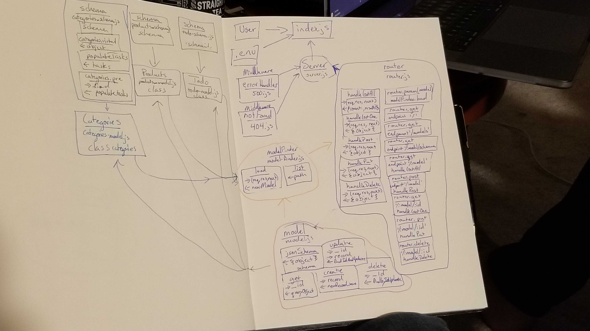

# LAB - 09

### Author: Morgan T Shaw

### Links and Resources

* [submission PR](https://github.com/morgan-401-advanced-javascript/lab09/pull/3)
* [travis](https://travis-ci.com/morgan-401-advanced-javascript/lab09)
* [front-end](https://lab9mts.herokuapp.com/)

### Setup
#### `.env` requirements
* `PORT` - 3000
* `MONGODB_URI` - mongodb://127.0.0.1:27017/app

#### Running the app
* `npm start`
  
#### Tests
* How do you run tests?
npm test

#### UML

